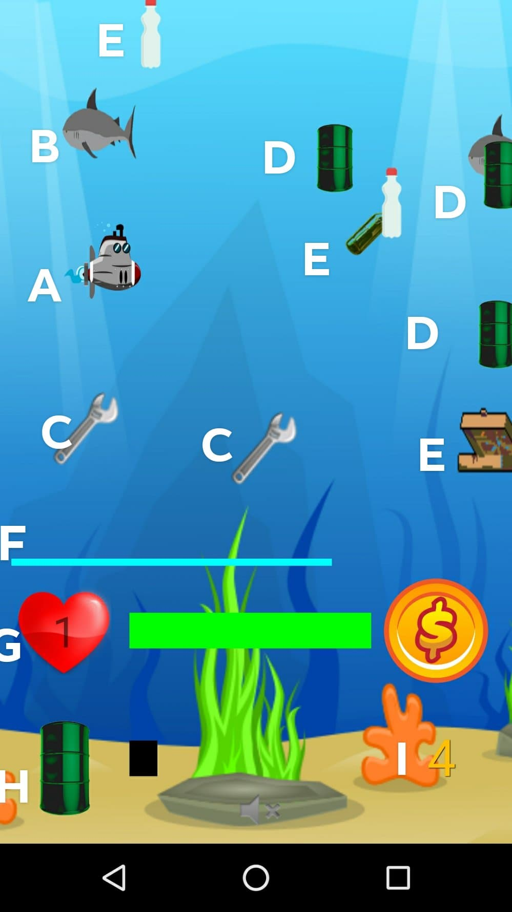

## Functioneel ontwerp / Functional design

`Ocean cleanup` is a game about a submarine that cleans the ocean from the garbage. Its goal is to collect as much garbage as possible. Each piece of garbage gives the submarine money, which can be used to repair, upgrade submarine and buy some fuel for it. But there are also obstacles, like the sharks, that will cause damage to the submarine..

#### Table of contents
- [Menu screen](#menu-screen)
- [Gameplay](#gameplay)

### Menu screen

This is the main activity, that is opened when tapping the app icon.
It's the title screen and main menu.  

- A. The logo + title.
- B. The new game button. Tapping it will [start a new game](#gameplay)
  with default money, health and fuel values and the first level of game
  difficulty
- C. The settings button. Tapping it will navigate to the
  [settings bar](#settings), where you can change the volume of music
  and sounds in the game.
- D. The authors button. Shows the [authors](#authors) of the game on
  the screen
- E. The donate button. Tapping it will navigate to the
  [ocean cleanup website](#donate), where the player can donate money
  for the actual ocean cleanup campaign.
- F. The sound button. Turns the music on/off
- The background is just a static non-interactive picture.

##### Settings
There are only two settings - volume of music and volume of sounds of
the game 

##### Authors
List of game authors 

##### Donate
Web-page for donations for real ocean cleanup campaign 

### Gameplay

This section explains the actual game-play. 

- A. The submarine, our hero. The user can navigate onto any point on
  the screen. The submarine is animated, so it looks like engine is
  working. Movement speed in any direction is limited to some (to be
  determined) constant. 
- B. Sharks. They can move either to left or right side of the screen
  with random speed. Once the submarine touches the shark, it causes
  damage to submarine and health points are reduced. Also a special
  [redness](#example-redness) appears as an indicator of damage.
  Eventually, the submarine can be [destroyed](#game-over-menu).
- C. Wrench. A kind of power up for the Submarine, which increases the
  health level once Submarine touches it
- D. Fuel barrel. A kind of power up for the Submarine, which increases
  the fuel level once Submarine touches it
- E. Garbage pieces. They move from right to the left side of the screen
  with random speed. There are three types available: plastic bottle,
  glass bottle and pizza bag. Once the submarine touches a garbage
  piece, the money balance of the player increases and the garbage
  disappears.
- F. Level timeline. The 'timer' of the level. Once it is finished, the
  level is [complete](#level-end-menu) and the player can proceed to the
  [shop](#shop), and then to the next level
- G. Health level. Consists of two things - the number of 'lifes' of the
  Submarine (in this case - 2 lifes, the 0 and 1) and the level of
  health as a line. The line reduces once shark touches the Submarine
  and fills once the Submarine touches a Wrench
- H. Fuel level. Fuel level of the Submarine as a line. It reduces
  constantly with time and fills once the Submarine touches the fuel
  barrel
- I. Money balance. Shows how much money does the Submarine have,
  Increases every time the Submarine collects garbage.
- Background. A moving background map of the game.

##### Game over menu 
This screen appears once the Submarine is dead 

- A. Give up button. Erases al the game progress and navigates to the
  [main menu](#menu-screen).
- B. Number of lifes. For this example, the Submarine still has one more
  life, so it can continue playing
- C. Continue button. Allows the player to continue the game at the
  point when (s)he lost

##### Level end menu
This screen appears once the player has completed the level 

- A. Shop button. Allows the player to go the [shop](#shop)

##### Example redness
Special redness effect that indicates the damage from sharks 

### Shop
This is the shop screen, where the player can buy different upgrades and proceed with the game 

- A. Upgrade item Includes picture of the upgrade, name, brief
  description and the price
- B. Money balance. The amount of money left for user to buy the
  upgrades
- C. Continue button. Allows the player to proceed with the game
- D. Buy button. Allows the player to buy an upgrade item (if there is
  enough balance nd the last available level of the upgrade was not
  reached, of course)

