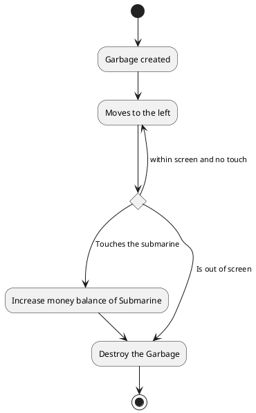

## Technisch ontwerp / Technical design

### About this document

This document is written in Markdown using PlantUML for diagrams. It contains information about technical implementation of game "Ocean cleanup". This document will be updated along with progress of developing the game.<br>
#### Table of contents
- [Class diagram](#class-diagram)
- [Activity diagram](#activity-diagram)
- [Description of classes](#description-of-classes)
### Class diagram
***Note***: This is the first version of the class diagram. It misses some details and will be improved later.
```plantuml

skinparam class {
    BackgroundColor<< lib >> white
}

class Game 
GameModel <|-- Game

class model.Submarine {
    + draw(GameView)
    + tick()
    + handleTouch(Touch)
}

Entity <|-- model.Submarine

class model.EntityCreator {
    + draw(GameView)
    + tick()
}
Entity <|-- model.EntityCreator


abstract class model.garbage.Garbage
Entity <|-- model.garbage.Garbage

class model.garbage.graphics.GlassBottle
model.garbage.Garbage <|--- model.garbage.graphics.GlassBottle

class model.garbage.graphics.PlasticBottle
model.garbage.Garbage <|--- model.garbage.graphics.PlasticBottle

class model.garbage.graphics.PizzaBag
model.garbage.Garbage <|--- model.garbage.graphics.PizzaBag

abstract class model.sharks.Shark
Entity <|-- model.sharks.Shark

class model.sharks.graphics.SharkLeft
model.sharks.Shark <|--- model.sharks.graphics.SharkLeft
class model.sharks.graphics.SharkRight
model.sharks.Shark <|--- model.sharks.graphics.SharkRight


class BackgroundOcean
Entity <|-- BackgroundOcean

class Collision
Entity <|- Collision

abstract class model.powerup.PowerUp
Entity <|-- model.powerup.PowerUp

class model.powerup.Wrench
model.powerup.PowerUp <|-- model.powerup.Wrench

class model.powerup.FuelBarrel
model.powerup.PowerUp <|-- model.powerup.FuelBarrel

abstract class model.shop.Upgrade

class model.shop.SafeTimeUpgrade
model.shop.Upgrade <|-- model.shop.SafeTimeUpgrade

class model.shop.LifeUpgrade
model.shop.Upgrade <|-- model.shop.LifeUpgrade

class model.shop.HullUpgrade
model.shop.Upgrade <|-- model.shop.HullUpgrade

class model.shop.HealthUpgrade
model.shop.Upgrade <|-- model.shop.HealthUpgrade

class model.shop.HealGainMultiplyUpgrade
model.shop.Upgrade <|-- model.shop.HealGainMultiplyUpgrade

class model.shop.FuelTankUpgrade
model.shop.Upgrade <|-- model.shop.FuelTankUpgrade

class model.shop.FuelGainMultiplyUpgrade
model.shop.Upgrade <|-- model.shop.FuelGainMultiplyUpgrade

class progress.GameProgress


class Activity
android.AppCompatActivity <|-- Activity


class Entity<<lib>> {
    + draw(GameView)
    + tick()
    + handleTouch(Touch)
    + getLayer(): int
}

class GameModel<<lib>> {
    - actualWidth
    - actualHeight
    + getWidth()
    + getHeight()
    + start()
    + addEntityEntity)
    + removeEntity(Entity)
    + getEntities(X.class): List<X>
}

class GameView<<lib>> {
    + setGame(GameModel)
    + setPaused(boolean)

    + drawBitmap(...)
    + getCanvas(): Canvas
}


GameModel o-> "*" Entity

GameView --> GameModel

Activity --> Game
Activity -> GameView

Collision --> Game


class android.View {
    + onDraw()
}
class android.AppCompatActivity {
    + onCreate()
    + onResume()
    + onPause()
}

android.View <|-- GameView

```

### Activity diagram

This activity diagram describes the life-cycle of Garbage entity


### Description of classes
***Note***: In this section only the custom made classes and packages will be described. Follow the link to check the [library documentation](library-documentation.md).

- **Activity**<br>
Represents the activity where the game is actually happening. Contains the GameView and Game objects. Extends AppCompatActivity class.
- **BackgroundOcean**<br>
Extends entity. Represents the background of the gameplay. Currently it is just a static, non-interactive picture, but it will improve later to a moving map.
- **Collision**<br>
Extends entity. Represents the state of the Submarine when it touches a Garbage or Shark object. Destroys instances of Garbage or reduces health level of the Submarine respectively.
- **Game**<br>
Extends GameModel. Represents the game itself. Contains all the entities.
- **Package model**<br>
Contains all the model classes of the game
    - ***Package garbage***<br>
    Contains all the garbage related classes
        - **Garbage**<br>
        Abstract class. Extends Entity. Represents an instance of Garbage object. Describes properties like size, position, speed and price of garbage. Destroys any instance of itself once it is out of the screen. Position and speed are generated randomly, Moves only to the left of the screen.
        - **GlassBottle**<br>
        Extends Garbage. Represents a piece of garbage that looks like glass bottle.
        - **PlasticBottle**<br>
        Extends Garbage. Represents a piece of garbage that looks like plastic bottle.
        - **PizzaBag**<br>
        Extends Garbage. Represents a piece of garbage that looks like pizza bag.
    - ***Package sharks***<br>
    Contains all the sharks related classes
        - **Shark**<br>
        Abstract class.Extends Entity. Represents an instance of Shark object. Describes properties like size, position, speed and damage of shark. Position and speed are generated randomly. Destroys any instance of itself once it is out of the screen.
        - **SharkLeft**<br>
        Extends Shark. Represents a Shark that moves to the left of the screen.
        - **SharkRight**<br>
                Extends Shark. Represents a Shark that moves to the right of the screen.    
  -    ***Package shop***<br> Contains all the upgrades available in the
       shop
        -   **Upgrade**<br>
        Abstract class. Represents any possible update of the Submarine  
        -    **SafeTimeUpgrade**<br>
                Extends Upgrade. Represents a safe time upgrade of the Submarine
        -   **LifeUpgrade**<br>
            Extends Upgrade. Represents a life upgrade of the Submarine
        -    **HullUpgrade**<br> Extends Upgrade. Represents a hull
             upgrade of the Submarine
         -    **HealthUpgrade**<br> Extends Upgrade. Represents a health
              upgrade of the Submarine
        -    **HealGainMultiplyUpgrade**<br> Extends Upgrade. Represents
             a heal gain multiply upgrade of the Submarine 
         -    **FuelTankUpgrade**<br> Extends Upgrade. Represents a fuel tank
             upgrade of the Submarine
        -    **FuelGainMultiplyUpgrade**<br>Extends
             Upgrade. Represents a fuel gain multiply upgrade of the
             Submarine
        -   **UpgradeSampleProvider**<br> Data provider for the updates
  - ***Package powerup***<br> Contains all the powerups for the
    Submarine
    -   **PowerUp**<br> Abstract class. Represents all the powerups for
        the Submarine
    -   **FuelBarrel**<br> Extends PowerUp. Represents a fuel barrel
        that increases Submarine's fuel level
    -   **Wrench**<br> Extends PowerUp. Represents a wrench that
        increases Submarine's health level
  - **EntityCreator**<br> Extends Entity. Has a function of constantly
    adding new entities(Sharks and Garbages) to the game.
    - **Submarine**<br>
    Extends Entity. The main character of the game. Is controlled by touches of user. Has constant speed, initial health, fuel and money points. Looks like a GIF on the screen.
- **Package ondraw**<br>
Contains all the custom drawings.
  -   **StatusBar**<br> Extends View. Represents a custom made barline
      of health/fuel levels of the Submarine and timeline of the game
      level.
- **Package constraint**<br>
Contains all the custom compounds
    - **ConstraintStatusBar**<br>
    Extends ConstraintLayout. Represents a custom compound of HpFuelBar and TextView of money balance of the ship. All together they make a status "screen" of the Submarine.
  -   **ConstraintShopBar**<br> Extends ConstraintLayout. Represents the
      view of the game shop
  -   **ConstraintSettings**<br>Extends ConstraintLayout. Represents a
      view of a settings screen of the game
  -   **ConstraintLvEndMenu**<br>Extends ConstraintLayout. Represents a
      view of level-end menu of the game
  -   **ConstraintDeathMenu**<br>Extends ConstraintLayout. Represents a
      view of a death menu of the game
  -   **ConstraintAuthors**<br>Extends ConstraintLayout. Represents a
      view of an authors list of the game
- **Package adapters**
  -   **ShopAdapter**<br> Custom adapter fot the game shop items
- **Package audio_player** <br> Contains all game sound related classes
  -   **Music**<br> Is responsible for the game music
  -   **Sound**<br> Is responsible for the game sounds
- **Package progress**<br> Contains all the game progress classes
  -   **GameProgress**<br> Is responsible for the game progress: health,
      fuel levels, updates, level and etc


